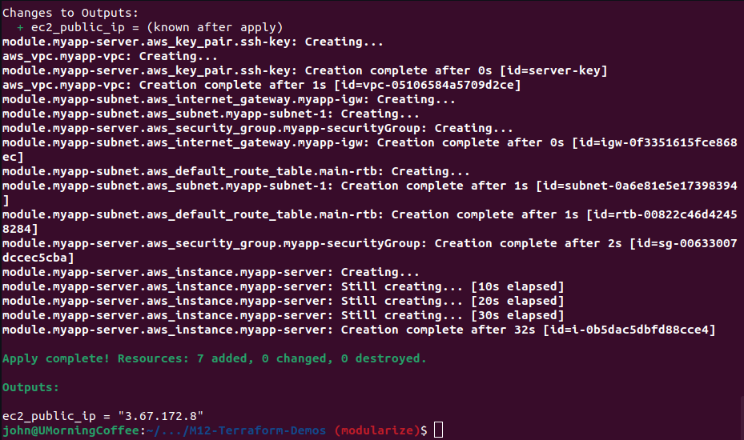

## Demo Project:
### Modularize Project

#### Technologies used:
- Terraform, AWS, Docker, Linux, Git

#### Project Description:
1.Divide Terraform resources into reusable modules

[git repo](https://github.com/jadedjelly/M12-Terraform-Demos/tree/modularize)

will modularize main.tf

- Common project structure:
    - main.tf
    - variables.tf
    - outputs.tf
    - providers.tf


*NOTE: don't have to link files to associate them to main, terraform recognizes them*

- created outputs.tf
    - Moved outputs to outputs.tf
- created variables.tf
    - Moved variables to variables.tf

#### Create a module

- Create a folder called "modules"
    - we create subfolders for the modules, eg:
        - webserver
        - subnet
    - Each folder will have: main.tf, variables.tf, providers, etc

*NOTE: there is a better way to create multiple files in different folders, but can't recall the syntax...*


- Project structure:
    - root module
        - child modules
            - a module that is called by another config

***TIP**: Group multiple resources in a logical unit*

We'll be referencing the subnet module in the root of the project, so we need to be able to pass in parameters to the modules... ergo we need to make it highly configurable

example, take the resource "aws_subnet" "myapp-subnet-1"

previously:
```terraform
resource "aws_subnet" "myapp-subnet-1" {
  vpc_id = aws_vpc.myapp-vpc.id
  cidr_block = var.subnet_cidr_block
  availability_zone = var.avail_zone
  tags = {
    Name: "${var.env_prefix}-subnet-1"
  }
}
```

modularized:
```terraform
resource "aws_subnet" "myapp-subnet-1" {
  vpc_id = var.vpc_id
  cidr_block = var.subnet_cidr_block
  availability_zone = var.avail_zone
  tags = {
    Name: "${var.env_prefix}-subnet-1"
  }
}
```

- obviously now, we'll need have these variables defined in the variables.tf file
    - we need to keep, below in both variables files:
        - variable avail_zone {}
        - variable env_prefix {}

#### Use the module

we add "module" resource to the root main.tf file, as below


As you can see from the error / tooltip from intellij the block is expecting information, these are the values to the variables (cidrblock, env_prefix, etc)

*Module comparison to function: *
*- input variables = like function arguments*
*- output values = like function return values*

- for the parameters, eg: subnet_cidr_block we can either hardcode it or reference it!
    - we are going to ref a variable that has to be defined in the same module where the main.tf is!

**NOTE:**
Values are defined in .tfvars file > set as values in variables.tf in root > values are passed to child module as arguments > via variables.tf in child module

```terraform
module "myapp-subnet" {
  source = "./modules/subnet"
  subnet_cidr_block = var.subnet_cidr_block
  avail_zone = var.avail_zone
  env_prefix = var.env_prefix
  vpc_id = aws_vpc.myapp-vpc.id
  default_route_table_id = aws_vpc.myapp-vpc.default_route_table_id
}
```

#### Module Output

- How to access the resources of a child module?
    - EG: the subnet id
        - which is created by the subnet module

We need to output a value, so it can be used (think of it as a return value from a function)

- From the "outputs.tf" file, we add the below:
    - we can give the output any name we want, but best to keep it as descriptive as you can (obvs)

```terraform
output "subnet" {
  value = aws_subnet.myapp-subnet-1
}
```

- in main.tf in the root, we change the value of subnet_id from:
    - "aws_subnet.myapp-subnet-1.id"
        - to
    - "module.myapp-subnet.subnet.id"
- the latter is a call from the output in the modules folder ref'ing the subnet 9which we created in the outputs folder

#### Apply configuration changes

*NOTE: I've had to run terraform init with every branch, so not sure why Nana has only had to do it once!!*

*NOTE: We have only modularized subnet, and not webserver*

*NOTE - From Terraform, after init*
*If you ever set or change modules or backend configuration for Terraform,
rerun this command to reinitialize your working directory. If you forget, other
commands will detect it and remind you to do so if necessary.*

- The output from terraform plan, we can see all the modules
    - module.myapp-subnet.aws_subnet.myapp-subnet-1
    - module.myapp-subnet.aws_internet_gateway.myapp-igw
    - module.myapp-subnet.aws_default_route_table.main-rtb

- I run terraform apply --auto-approve


No errors, and everything is created without issue

Further testing to be done on "outputs"

#### Create "Webserver" Module

The "webserver" module before we modularize it, is as follows:
- AMI query (*the one that makes sure your getting the latest!*)
- Keypair
- Instance itself
- security group

We paste the above resources into modules/webserver/main.tf
- Now we need to fix the ref's as the same wouldn't be available, eg:
    - aws_vpc.myapp-vpc.id > var.vpc_id
    - subnet_id = module.myapp-subnet.subnet.id > var.subnet_id
    - aws_security_group.myapp-securityGroup.id > var.myapp-securitygroup.id
- Nana extracts the value for the recent Amazon linux...
    - values = ["amzn2-ami-kernel-*-x86_64-gp2"] > values = var.image_name
        - "amzn2-ami-kernel-*-x86_64-gp2" needs to be associated in the tfvars file

Updated:
- Outputs (root & webserver)
- terraform.tfvars
- variables (root & webserver)
- main (root & webserver)

main.tf (root)
```terraform
provider "aws" {
  region = "eu-central-1"
}

resource "aws_vpc" "myapp-vpc" {
  cidr_block = var.vpc_cidr_block
  tags = {
    Name: "${var.env_prefix}-vpc"
  }
}

module "myapp-subnet" {
  source = "./modules/subnet"
  subnet_cidr_block = var.subnet_cidr_block
  avail_zone = var.avail_zone
  env_prefix = var.env_prefix
  vpc_id = aws_vpc.myapp-vpc.id
  default_route_table_id = aws_vpc.myapp-vpc.default_route_table_id
}

module "myapp-server" {
  source = "./modules/webserver"
  vpc_id = aws_vpc.myapp-vpc.id
  my_ip = var.my_ip
  image_name = var.image_name
  pub_location = var.pub_location
  instance_size = var.instance_size
  subnet_id = module.myapp-subnet.subnet.id
  avail_zone = var.avail_zone
  env_prefix = var.env_prefix
}
```

main.tf (modules/webserver)
```terraform
resource "aws_security_group" "myapp-securityGroup" {
  name = "myapp-securityGroup"
  vpc_id = var.vpc_id

  ingress {
    from_port = 22
    to_port = 22
    protocol = "TCP"
    cidr_blocks = [var.my_ip]
  }
  ingress {
    from_port = 8080
    to_port = 8080
    protocol = "TCP"
    cidr_blocks = ["0.0.0.0/0"]
  }

  egress {
    from_port = 0
    to_port = 0
    protocol = "-1"
    cidr_blocks = ["0.0.0.0/0"]
    prefix_list_ids = []
  }
  tags = {
    Name : "${var.env_prefix}-securityGroup"
  }
}

data "aws_ami" "latest-amazon-linux-image" {
  most_recent = true
  owners = ["amazon"]
  filter {
    name = "name"
    values = [var.image_name]
  }
  filter {
    name = "virtualization-type"
    values = ["hvm"]
  }
}


resource "aws_key_pair" "ssh-key" {
  key_name = "server-key"
  public_key = file(var.pub_location)
}


resource "aws_instance" "myapp-server" {
  ami = data.aws_ami.latest-amazon-linux-image.id
  instance_type = var.instance_size

  subnet_id = var.subnet_id
  vpc_security_group_ids = [aws_security_group.myapp-securityGroup.id]
  availability_zone = var.avail_zone

  associate_public_ip_address = true
  key_name = aws_key_pair.ssh-key.key_name

  #   user_data = <<EOF
  # #!/bin/bash
  # sudo yum update -y && sudo yum install -y docker
  # sudo systemctl start docker
  # sudo usermod -aG docker ec2-user
  # docker run -p 8080:80 nginx
  # EOF

  user_data = file("entry-script.sh")
  user_data_replace_on_change = true

  tags = {
    Name: "${var.env_prefix}-ec2"
  }
}
```

#### Apply Configuration changes

(*Note: inf destroyed in previous chapter*)



SSH into server & running docker ps

