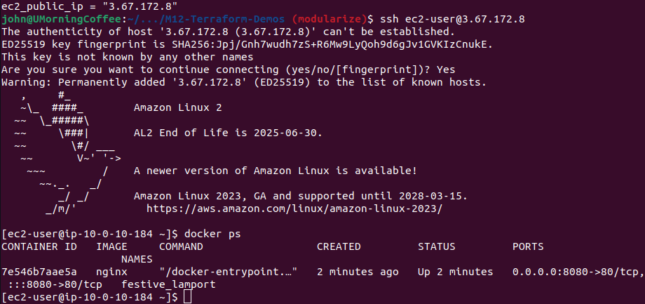
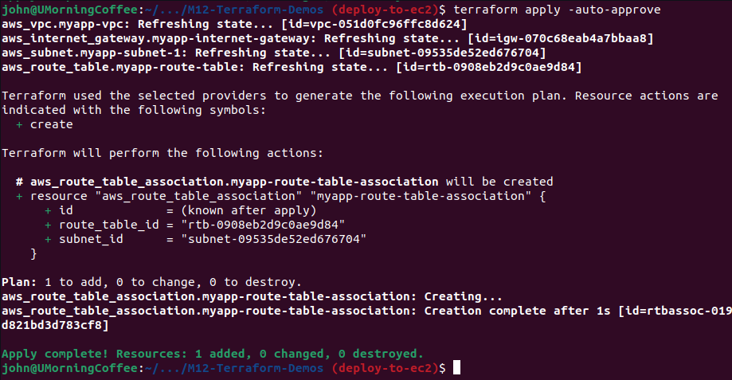

## Demo Project:
### Automate AWS Infrastructure

#### Technologies used:
- Terraform, AWS, Docker, Linux, Git

#### Project Description:
1. Create TF project to automate provisioning AWS Infrastructure and its components, such as: VPC, Subnet, Route Table, Internet Gateway, EC2, Security Group
2. Configure TF script to automate deploying Docker container to EC2 instance

- [starting code](https://github.com/jadedjelly/M12-Terraform-Demos/tree/starting-code)
- [deploy to EC2 code](https://github.com/jadedjelly/M12-Terraform-Demos/tree/deploy-to-ec2)

- cleaning up variable names in main.tf
- adding prefix for the Env to name tags
    - the use of "gluing" prefixes is very similar to python f{}
- created variables in tfvars file
- had to run terraform init command (probably because of the conflict issues solved earlier!)


- then ran terraform plan


- Ran terraform apply -auto-approve and TF created the subnet & vpc


| main.tf   |
|-----------|

```terraform
provider "aws" {
  region = "eu-central-1"
}

variable vpc_cidr_block {}
variable subnet_cidr_block {}
variable avail_zone {}
variable env_prefix {}

resource "aws_vpc" "myapp-vpc" {
  cidr_block = var.vpc_cidr_block
  tags = {
    Name: "${var.env_prefix}-vpc"
  }
}

resource "aws_subnet" "myapp-subnet-1" {
  vpc_id = aws_vpc.myapp-vpc.id
  cidr_block = var.subnet_cidr_block
  availability_zone = var.avail_zone
  tags = {
    Name: "${var.env_prefix}-subnet-1"
  }
}
```

| providers.tf |
|--------------|
```terraform
terraform {
  required_providers {
    aws = {
      source = "hashicorp/aws"
      version = "5.20.1"
    }
  }
}
```

| terraform.tfvars |
|------------------|
```terraform
vpc_cidr_block = "10.0.0.0/16"

subnet_cidr_block = "10.0.10.0/24"

avail_zone = "eu-central-1b"

env_prefix = "dev"
```

#### Route table & Internet gateway

Aws created the following for us:
- Route table
    - Virtual router
- nACL (network access control lists)
    - Firewall

- We'll create a new Route table, igw (internet gateway) & internal traffic

**Best Practice**
*Create new components, instead of using default ones!*

- We can have the resources in any order, as Terraform will know what order they should be created in

main.tf (with addition of route table and igw creation - no change to providers or  variables file)

```terraform
resource "aws_route_table" "myapp-route-table" {
  vpc_id = aws_vpc.myapp-vpc.id

  route {
    cidr_block = "0.0.0.0/0"
    gateway_id = aws_internet_gateway.myapp-internet-gateway.id
  }
  tags = {
    Name: "${var.env_prefix}-route-table"
  }
}

resource "aws_internet_gateway" "myapp-internet-gateway" {
  vpc_id = aws_vpc.myapp-vpc.id
}
tags = {
  Name: "${var.env_prefix}-internet-gateway"
}
```


aws Route tables:



aws IGW:


#### Subnet association w/ Route Table

- Clicking inside the route table we see there's no subnet association
  *The following subnets have not been explicitly associated with any route tables and are therefore associated with the main route table:*

- We need to associate **our** route table with **our** subnet
    - The intellij plugin makes this incredibly easy to do!

main.tf (addition of aws_route_table_association resource)

```terraform
resource "aws_route_table_association" "myapp-route-table-association" {
  route_table_id = aws_route_table.myapp-route-table.id
  subnet_id = aws_subnet.myapp-subnet-1.id
}
```



aws route table association:


#### Use the Main Route Table

We could potentially use the Route tables that are created by AWS, the below guides us through it

- we comment out parts of main.tf:
    - aws_route_table_association
    - aws_route_table


we get the "aws_vpc.myapp-vpc.id" by running the state show command as below:


main.tf (addition of aws_default_route_table resource)

```terraform
resource "aws_default_route_table" "default-route-table" {
  default_route_table_id = aws_vpc.myapp-vpc.default_route_table_id
  route {
    cidr_block = "0.0.0.0/0"
    gateway_id = aws_internet_gateway.myapp-internet-gateway.id
  }
  tags = {
    Name: "${var.env_prefix}-default-route-table"
  }
}
```

#### Security group

We want port 8080 & 22 open

incoming traffic uses **ingress**
- you can set a range of ports here, by using:

```terraform
from_port = 0
to_port = 1000
```

- In a corp env, you would probably have a range (as a list using [] ) of ips for ssh access (this refers to the cidr_block below)

- we create a resource ws_security_group, and here we define the inbound & outbound rules

main.tf
```terraform
resource "aws_security_group" "myapp-securityGroup" {
  name = myapp-securityGroup
  vpc_id = aws_vpc.myapp-vpc.id

  ingress {
    from_port = 22
    to_port = 22
    protocol = "TCP"
    cidr_blocks = [var.my_ip]
  }
  ingress {
    from_port = 8080
    to_port = 8080
    protocol = "TCP"
    cidr_blocks = ["0.0.0.0/0"]
  }

}
```

- we created a variable for our public IP (I do have a script somewhere that pull this data, need to see if it'll work here)

terraform.tfvars
```terraform
my_ip = "2.25.9.9/32"
```

outbound traffic uses **egress**

- installations
- fetch Docker image

```terraform
  egress {
  # allows any traffic to leave the VPC
    from_port = 0
    to_port = 0
    protocol = "-1"
    cidr_blocks = ["0.0.0.0/0"]
    prefix_list_ids = []
  }
```

[documentation](https://registry.terraform.io/providers/hashicorp/aws/latest/docs/resources/vpc_security_group_egress_rule)

breakdown:
- port 0 > means any port
- protocol "-1" > any
- prefix_list_ids [] > allows access to vpc

The Security group change to main.tf:

```terraform
resource "aws_security_group" "myapp-securityGroup" {
  name = myapp-securityGroup
  vpc_id = aws_vpc.myapp-vpc.id

  ingress {
    from_port = 22
    to_port = 22
    protocol = "TCP"
    cidr_blocks = [var.my_ip]
  }
  ingress {
    from_port = 8080
    to_port = 8080
    protocol = "TCP"
    cidr_blocks = ["0.0.0.0/0"]
  }

  egress {
    from_port = 0
    to_port = 0
    protocol = "-1"
    cidr_blocks = ["0.0.0.0/0"]
    prefix_list_ids = []
  }
  tags = {
    Name : "${var.env_prefix}-securityGroup"
  }
}
```

- we run apply
  -didn't pipe the output to a file, so can't show all of it


AWS security group console:


**NOTE: When we create a VPC, AWS automatically creates a Security group.**
(Is this only the case when your doing this in stages? Like we are doing here? Will test later)

#### Use Default Security group

Nana goes on to show how to use the default security group
Without moving ahead, I have guessed this looks like below:

```terraform
resource "aws_default_security_group" "default-sg" {
  name = "default-sg"
  vpc_id = "${aws_vpc.myapp-vpc.id}"

  ingress {
    from_port = 22
    to_port = 22
    protocol = "TCP"
    cidr_blocks = [var.my_ip]
  }
  ingress {
    from_port = 8080
    to_port = 8080
    protocol = "TCP"
    cidr_blocks = ["0.0.0.0/0"]
  }

  egress {
    from_port = 0
    to_port = 0
    protocol = "-1"
    cidr_blocks = ["0.0.0.0/0"]
    prefix_list_ids = []
  }
  tags = {
    Name : "${var.env_prefix}-securityGroup"
  }
}

```

Nana's version

Identical to above, except "name = "default-sg"" has been removed

#### Amazon Machine Image for Ec2

- we create the resource type
- there are 2x required attributes for aws instance
    - ami
        - the os the server is going to run (mac, debian, red hat, opensuse, etc)
        - differs between regions
        - can change when new versions are released
        - we will set ami **dynamically**
            - changes along with versions, regions, etc
            - we do this by creating a data source
                - one of the attributes needed is "owner"
                    - we can get this, by going to images > AMIs (from the left menu), searching by the ami ID (ami-098c93bd9d119c051) (see below screenshot)
                    - we can also use AMI created by you (you'll see this is more depth during the AWS Solutions Arch course)
                - we also add a filter block, where we can state "I want the latest image, from amazon, with the name of X"
                    - here we are going to filter by images that start with "amzn2-ami-kernel" and end in "86_64-gp2"
                        - very easy to filter just add it as "amzn2-ami-kernel-*-x86_64-gp2"
                    - You can add multiple filter blocks (*one filter per block!!*)


main.tf we add the data source looking ofr the ami-id for the latest image from amazon with the applied filters (name starting & ending with (with a wildcard in the middle) "amzn2-ami-kernel-*-x86_64-gp2") and a Virtualization type of "hvm"

```terraform
data "aws_ami" "latest-amazon-linux-image" {
  most_recent = true
  owners = ["amazon"]
  filter {
    name = "name"
    values = ["amzn2-ami-kernel-*-x86_64-gp2"]
  }
  filter {
    name = "virtualization-type"
    values = ["hvm"]
  }
}
# 
# output "test_ami" {
#   value = data.aws_ami.latest-amazon-linux-image
# }

resource "aws_instance" "myapp-server" {
  ami = data.aws_ami.latest-amazon-linux-image.id
}
```

**NOTE: the commented out part, is outputting the value of "data.aws..."" which is shown below:**

```textmate
data.aws_ami.latest-amazon-linux-image: Reading...
aws_vpc.myapp-vpc: Refreshing state... [id=vpc-051d0fc96ffc8d624]
data.aws_ami.latest-amazon-linux-image: Read complete after 1s [id=ami-0a946522147cbcbcc]
aws_internet_gateway.myapp-internet-gateway: Refreshing state... [id=igw-070c68eab4a7bbaa8]
aws_subnet.myapp-subnet-1: Refreshing state... [id=subnet-09535de52ed676704]
aws_security_group.myapp-securityGroup: Refreshing state... [id=sg-087136b5f7275ec21]
aws_route_table.myapp-route-table: Refreshing state... [id=rtb-0ed61e09e44d622af]
aws_route_table_association.myapp-route-table-association: Refreshing state... [id=rtbassoc-02c8bf11037e19b08]

Changes to Outputs:
  + test_ami = {
      + architecture          = "x86_64"
      + arn                   = "arn:aws:ec2:eu-central-1::image/ami-0a946522147cbcbcc"
      + block_device_mappings = [
          + {
              + device_name  = "/dev/xvda"
              + ebs          = {
                  + delete_on_termination = "true"
                  + encrypted             = "false"
                  + iops                  = "0"
                  + snapshot_id           = "snap-0a9edf8b48d1dc213"
                  + throughput            = "0"
                  + volume_size           = "8"
                  + volume_type           = "gp2"
                }
              + no_device    = ""
              + virtual_name = ""
            },
        ]
      + boot_mode             = ""
      + creation_date         = "2024-04-13T00:23:53.000Z"
      + deprecation_time      = "2025-07-01T00:00:00.000Z"
      + description           = "Amazon Linux 2 Kernel 5.10 AMI 2.0.20240412.0 x86_64 HVM gp2"
      + ena_support           = true
      + executable_users      = null
      + filter                = [
          + {
              + name   = "name"
              + values = [
                  + "amzn2-ami-kernel-*-x86_64-gp2",
                ]
            },
          + {
              + name   = "virtualization-type"
              + values = [
                  + "hvm",
                ]
            },
        ]
      + hypervisor            = "xen"
      + id                    = "ami-0a946522147cbcbcc"
      + image_id              = "ami-0a946522147cbcbcc"
      + image_location        = "amazon/amzn2-ami-kernel-5.10-hvm-2.0.20240412.0-x86_64-gp2"
      + image_owner_alias     = "amazon"
      + image_type            = "machine"
      + imds_support          = ""
      + include_deprecated    = false
      + kernel_id             = ""
      + most_recent           = true
      + name                  = "amzn2-ami-kernel-5.10-hvm-2.0.20240412.0-x86_64-gp2"
      + name_regex            = null
      + owner_id              = "137112412989"
      + owners                = [
          + "amazon",
        ]
      + platform              = ""
      + platform_details      = "Linux/UNIX"
      + product_codes         = []
      + public                = true
      + ramdisk_id            = ""
      + root_device_name      = "/dev/xvda"
      + root_device_type      = "ebs"
      + root_snapshot_id      = "snap-0a9edf8b48d1dc213"
      + sriov_net_support     = "simple"
      + state                 = "available"
      + state_reason          = {
          + code    = "UNSET"
          + message = "UNSET"
        }
      + tags                  = {}
      + timeouts              = null
      + tpm_support           = ""
      + usage_operation       = "RunInstances"
      + virtualization_type   = "hvm"
    }

You can apply this plan to save these new output values to the Terraform
state, without changing any real infrastructure.

─────────────────────────────────────────────────────────────────────────────

Note: You didn't use the -out option to save this plan, so Terraform can't
guarantee to take exactly these actions if you run "terraform apply" now.

```

#### Create EC2 Instance

The 2nd required attribute is **instance_type**
- this is the size (t2 micro, etc)
    - we made this as a variable

The rest of the attributes are optional, however we want to set it up the ec2 instance is in the correct subnet & security group. If we don't define them here, they will be added to the default groups

we add:
- subnet_id
- vpc_security_group_ids (this could be a list)
- availability_zone
- associate_public_ip_address
- Created a new keypair
    - moved to authorized_keys & changed permissions on it (chmod 400 etc)

main.tf
```terraform
resource "aws_instance" "myapp-server" {
  ami = data.aws_ami.latest-amazon-linux-image.id
  instance_type = var.instance_size

  subnet_id = aws_subnet.myapp-subnet-1.id
  vpc_security_group_ids = [aws_security_group.myapp-securityGroup.id]
  availability_zone = var.avail_zone

  associate_public_ip_address = true
  key_name = "terraform_demo-key"

  tags = {
    Name: "${var.env_prefix}-ec2"
  }
}
```

- we run terraform plan 1st to see all the changes
    - NOTE: I previously destroyed everything, due to an issue with availability zones

Output from plan:
```textmate
john@UMorningCoffee:~/.../M12-Terraform-Demos (deploy-to-ec2)$ terraform plan
data.aws_ami.latest-amazon-linux-image: Reading...
data.aws_ami.latest-amazon-linux-image: Read complete after 0s [id=ami-0a946522147cbcbcc]

Terraform used the selected providers to generate the following execution plan. Resource actions are
indicated with the following symbols:
  + create

Terraform will perform the following actions:

  # aws_instance.myapp-server will be created
  + resource "aws_instance" "myapp-server" {
      + ami                                  = "ami-0a946522147cbcbcc"
      + arn                                  = (known after apply)
      + associate_public_ip_address          = true
      + availability_zone                    = "eu-central-1b"
      + cpu_core_count                       = (known after apply)
      + cpu_threads_per_core                 = (known after apply)
      + disable_api_stop                     = (known after apply)
      + disable_api_termination              = (known after apply)
      + ebs_optimized                        = (known after apply)
      + get_password_data                    = false
      + host_id                              = (known after apply)
      + host_resource_group_arn              = (known after apply)
      + iam_instance_profile                 = (known after apply)
      + id                                   = (known after apply)
      + instance_initiated_shutdown_behavior = (known after apply)
      + instance_lifecycle                   = (known after apply)
      + instance_state                       = (known after apply)
      + instance_type                        = "t2.micro"
      + ipv6_address_count                   = (known after apply)
      + ipv6_addresses                       = (known after apply)
      + key_name                             = "terraform_demo-key"
      + monitoring                           = (known after apply)
      + outpost_arn                          = (known after apply)
      + password_data                        = (known after apply)
      + placement_group                      = (known after apply)
      + placement_partition_number           = (known after apply)
      + primary_network_interface_id         = (known after apply)
      + private_dns                          = (known after apply)
      + private_ip                           = (known after apply)
      + public_dns                           = (known after apply)
      + public_ip                            = (known after apply)
      + secondary_private_ips                = (known after apply)
      + security_groups                      = (known after apply)
      + source_dest_check                    = true
      + spot_instance_request_id             = (known after apply)
      + subnet_id                            = (known after apply)
      + tags                                 = {
          + "Name" = "dev-ec2"
        }
      + tags_all                             = {
          + "Name" = "dev-ec2"
        }
      + tenancy                              = (known after apply)
      + user_data                            = (known after apply)
      + user_data_base64                     = (known after apply)
      + user_data_replace_on_change          = false
      + vpc_security_group_ids               = (known after apply)
    }

  # aws_internet_gateway.myapp-internet-gateway will be created
  + resource "aws_internet_gateway" "myapp-internet-gateway" {
      + arn      = (known after apply)
      + id       = (known after apply)
      + owner_id = (known after apply)
      + tags     = {
          + "Name" = "dev-internet-gateway"
        }
      + tags_all = {
          + "Name" = "dev-internet-gateway"
        }
      + vpc_id   = (known after apply)
    }

  # aws_route_table.myapp-route-table will be created
  + resource "aws_route_table" "myapp-route-table" {
      + arn              = (known after apply)
      + id               = (known after apply)
      + owner_id         = (known after apply)
      + propagating_vgws = (known after apply)
      + route            = [
          + {
              + cidr_block                 = "0.0.0.0/0"
              + gateway_id                 = (known after apply)
                # (11 unchanged attributes hidden)
            },
        ]
      + tags             = {
          + "Name" = "dev-route-table"
        }
      + tags_all         = {
          + "Name" = "dev-route-table"
        }
      + vpc_id           = (known after apply)
    }

  # aws_route_table_association.myapp-route-table-association will be created
  + resource "aws_route_table_association" "myapp-route-table-association" {
      + id             = (known after apply)
      + route_table_id = (known after apply)
      + subnet_id      = (known after apply)
    }

  # aws_security_group.myapp-securityGroup will be created
  + resource "aws_security_group" "myapp-securityGroup" {
      + arn                    = (known after apply)
      + description            = "Managed by Terraform"
      + egress                 = [
          + {
              + cidr_blocks      = [
                  + "0.0.0.0/0",
                ]
              + from_port        = 0
              + ipv6_cidr_blocks = []
              + prefix_list_ids  = []
              + protocol         = "-1"
              + security_groups  = []
              + self             = false
              + to_port          = 0
                # (1 unchanged attribute hidden)
            },
        ]
      + id                     = (known after apply)
      + ingress                = [
          + {
              + cidr_blocks      = [
                  + "0.0.0.0/0",
                ]
              + from_port        = 8080
              + ipv6_cidr_blocks = []
              + prefix_list_ids  = []
              + protocol         = "tcp"
              + security_groups  = []
              + self             = false
              + to_port          = 8080
                # (1 unchanged attribute hidden)
            },
          + {
              + cidr_blocks      = [
                  + "2.25.9.9/32",
                ]
              + from_port        = 22
              + ipv6_cidr_blocks = []
              + prefix_list_ids  = []
              + protocol         = "tcp"
              + security_groups  = []
              + self             = false
              + to_port          = 22
                # (1 unchanged attribute hidden)
            },
        ]
      + name                   = "myapp-securityGroup"
      + name_prefix            = (known after apply)
      + owner_id               = (known after apply)
      + revoke_rules_on_delete = false
      + tags                   = {
          + "Name" = "dev-securityGroup"
        }
      + tags_all               = {
          + "Name" = "dev-securityGroup"
        }
      + vpc_id                 = (known after apply)
    }

  # aws_subnet.myapp-subnet-1 will be created
  + resource "aws_subnet" "myapp-subnet-1" {
      + arn                                            = (known after apply)
      + assign_ipv6_address_on_creation                = false
      + availability_zone                              = "eu-central-1b"
      + availability_zone_id                           = (known after apply)
      + cidr_block                                     = "10.0.10.0/24"
      + enable_dns64                                   = false
      + enable_resource_name_dns_a_record_on_launch    = false
      + enable_resource_name_dns_aaaa_record_on_launch = false
      + id                                             = (known after apply)
      + ipv6_cidr_block_association_id                 = (known after apply)
      + ipv6_native                                    = false
      + map_public_ip_on_launch                        = false
      + owner_id                                       = (known after apply)
      + private_dns_hostname_type_on_launch            = (known after apply)
      + tags                                           = {
          + "Name" = "dev-subnet-1"
        }
      + tags_all                                       = {
          + "Name" = "dev-subnet-1"
        }
      + vpc_id                                         = (known after apply)
    }

  # aws_vpc.myapp-vpc will be created
  + resource "aws_vpc" "myapp-vpc" {
      + arn                                  = (known after apply)
      + cidr_block                           = "10.0.0.0/16"
      + default_network_acl_id               = (known after apply)
      + default_route_table_id               = (known after apply)
      + default_security_group_id            = (known after apply)
      + dhcp_options_id                      = (known after apply)
      + enable_dns_hostnames                 = (known after apply)
      + enable_dns_support                   = true
      + enable_network_address_usage_metrics = (known after apply)
      + id                                   = (known after apply)
      + instance_tenancy                     = "default"
      + ipv6_association_id                  = (known after apply)
      + ipv6_cidr_block                      = (known after apply)
      + ipv6_cidr_block_network_border_group = (known after apply)
      + main_route_table_id                  = (known after apply)
      + owner_id                             = (known after apply)
      + tags                                 = {
          + "Name" = "dev-vpc"
        }
      + tags_all                             = {
          + "Name" = "dev-vpc"
        }
    }

Plan: 7 to add, 0 to change, 0 to destroy.

─────────────────────────────────────────────────────────────────────────────────────────────────────

Note: You didn't use the -out option to save this plan, so Terraform can't guarantee to take exactly
these actions if you run "terraform apply" now.
```

Terminal output


- we ssh in to the server:


#### Automate SSH key Pair

We create a new resource called "aws_key_pair"
attributes:
- key_name
- public_key
    - we use the one we have locally (~/.ssh/)
        - if you dont you can use the ssh-keygen command to create it
        - id_rsa (private)
        - id_rsa.pub (public)
    - we could paste the public key into the "public_key" attribute, but we don't want things like this available to public repos, so we create a variable for it
    - or we could ref the file location

```terraform
resource "aws_key_pair" "ssh-key" {
  key_name = "server-key"
  public_key = file(var.pub_location)
  
  # could add the below if we are not using local keys
  #tags = {
  #  Name : "${var.env_prefix}-Keypair"
  #}
}
```

*NOTE: You can create on the fly, will do this in my own projects!*

changes to the ec2 creation, but only where it gets the key
```terraform
resource "aws_instance" "myapp-server" {
  ami = data.aws_ami.latest-amazon-linux-image.id
  instance_type = var.instance_size

  subnet_id = aws_subnet.myapp-subnet-1.id
  vpc_security_group_ids = [aws_security_group.myapp-securityGroup.id]
  availability_zone = var.avail_zone

  associate_public_ip_address = true
  key_name = aws_key_pair.ssh-key.key_name

  tags = {
    Name: "${var.env_prefix}-ec2"
  }
}
```

Obvs they instance would need to be replaced, if we change the key

Running terraform apply, and waiting a min or 2, the new ec2 instance is up & running. Ssh'ing to the instance, instead of point it to a file you can simply just type

```bash
ssh ec2-user@3.67.207.101
```


- we can also output the public IP of the instance, instead of having to get it from the console
- we can run (terraform state show aws_instance.myapp-server) to see the attributes


```terraform
output "ec2_public_ip" {
  value = aws_instance.myapp-server.public_ip
}
```

#### Run entrypoint script to start docker container

You could do this manually, but who would want to.... automation = life...

- We can do this inside the aws_instance resource
    - we add the attribute "user_data = x"
        - 1st way, is hardcoding it, by ending the "user_data = <<EOF  <block of install docker, nginx, etc>  EOF"

```bash
# between the EOFs you would add the below:
#!/bin/bash
sudo yum update -y && sudo yum install -y docker 
# should probably add systemctl enable docker, so it restarts on reboot 
sudo systemctl start docker
sudo usermod -aG docker ec2-user 
docker run -p 8080:80 nginx

```

- we also need to add "user_data_replace_on_change" outside the EOF block, this is because:
    - *Updates to this field will trigger a stop/start of the EC2 instance by default. If the user_data_replace_on_change is set then updates to this field will trigger a destroy and recreate.*

```terraform
  user_data = <<EOF
            # between the EOFs you would add the below:
            #!/bin/bash
            sudo yum update -y && sudo yum install -y docker
            # should probably add systemctl enable docker, so it restarts on reboot
            sudo systemctl start docker
            sudo usermod -aG docker ec2-user
            docker run -p 8080:80 nginx

            EOF

  user_data_replace_on_change = true
```

**execution of main.tf with user_data block, failed the 1st time, 2nd apply it all worked**


navigating to ec2s public ip & port number of 8080 we can see nginx welcome page


#### Extract to shell script (preferable way)

- same way we did it for the public key location (using file(path))

```terraform
  user_data = file("entry-script.sh")
```

- and creating a script called "entry-script.sh"

```bash
#!/bin/bash
sudo yum update -y && sudo yum install -y docker
sudo systemctl start docker
sudo usermod -aG docker ec2-user
docker run -p 8080:80 nginx
```

- we get the same result as we did last time (obvs the instance has to be recreated)

ssh to ec2 using new IP & running docker ps


nginx welcome page using new ec2 instance ip


#### Commit to own feature branch

*NOTE: I'm already doing this, code is [here](https://github.com/jadedjelly/M12-Terraform-Demos/tree/deploy-to-ec2)*

#### Configuring infrastructures, not servers

- Terraform gives us the option to run a script at startup, but note it doesn't allow for debugging if an issue occurs with it - which is normal seeing as it's not designed for it

This is why knowing the capabilities of Terraform is important, as Nana has described previously, you should know when to use Terraform and where it's use stops


**Terraform** is a tool for Creating & Managing **Infrastructure**
- Firewalls, Security groups, networking, etc

Managing applications, updating etc, should be done by another tool (Ansible / Puppet / Chef)

Tools like Ansible or Puppet or Chef (These would be the best known ones) are specifically made for deploying applications and configuring existing servers


